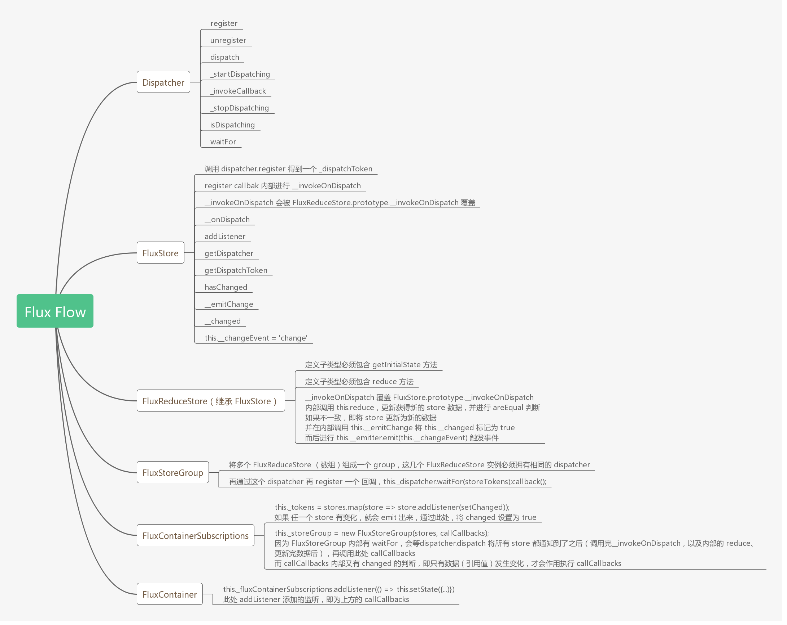

# Flux

## 大图 / 概览图 / 简略图

大图用于预览 / 回顾，代码调用 / 响应流程基本上从下往上，源码阅读顺序建议从上往下。

在此文件夹内，也已标注好了代码阅读顺序。

* 0.invariant.js
* 1.abstractMethod.js
* 2.Dispatcher.js
* 3.waitForDemo.js
* 4.FluxStore.js
* 5.FluxReduceStore.js
* 6.FluxStoreGroup.js
* 7.FluxContainerSubscriptions.js
* 8.FluxContainer.js
* 9.FluxMixinLegacy.js

## 感受
* 初看，会有点觉得这代码有点乱乱的感觉，组合得七七八八，到跑完 `waitForDemo` 之后，就都明晰了，waitFor 的设计还是比较巧妙的（既确保了只运行一次，也确保了只在最后运行），就是这 `waitFor` 的命名，比较容易让人产生歧义
* 把很多边界情况下的处理，错误的调用方式，都通过代码层面检测限定了，比较完善，特别是 `dispatcher.dispatch` 内部，可以看出是相当严谨了

## 其他
* 因为 `FluxStoreGroup` 限定了所有传入的 `store` 的 `dispatcher` 必须为同一个，这也就意味着，如果要把不同的 `store` 整合进一个 `component`，那就必须使用相同的 `dispatcher` 去初始化这些 `store`，其实也就意味着，基本上你只需要一个 `new Dispatcher` 出来
* `Container` 的包裹是以继承原 类型 的形式来做的，最终数据被集成在 `this.state` 内，而函数式组件，数据集成则需要通过 `props` 获取，详细可见：[counter.js - 2.flux](https://github.com/Xaber20110202/flux-redux-demo/blob/master/src/2.flux/counter.js)
* 数据变更的 `log` 记录，需要手动 `xxStore.addListener` 的方式，或者注释掉 Flux 源码内的这行有趣的代码 [FluxContainerSubscriptions console.log](https://github.com/Xaber20110202/FedSource/blob/master/2019.09.19%20flux/7.FluxContainerSubscriptions.js#L79)
* 因为 `getInitialState` 数据定义 和 `reduce` 数据更新方式，限定必须在 Store 的继承类上实现，因此只要一改动 `reduce` 代码，hotreload 进行之后，相应的原来网页上已经触发变化的 数据 状态，又会回到 `initialState`
* 以及两外两个缺陷（引用摘自 [《看漫画，学 Redux》 —— A cartoon intro to Redux](https://github.com/jasonslyvia/a-cartoon-intro-to-redux-cn)）
    * 每次触发 action 时状态对象都被直接改写了 （撤回功能）
    * 不易于扩展，没有合适的位置实现第三方插件（插件体系）

## Demo
如果想跟随调用方式，更清晰了解 Flux 的运作方式，可以查看此部分代码

[controlpannel - 2.flux](https://github.com/Xaber20110202/flux-redux-demo/tree/master/src/2.flux)